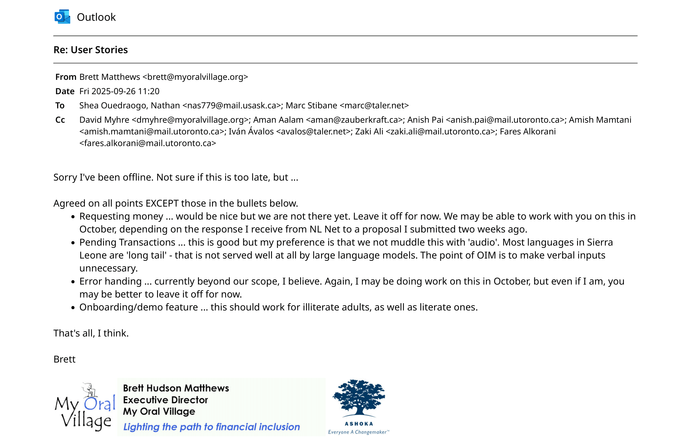
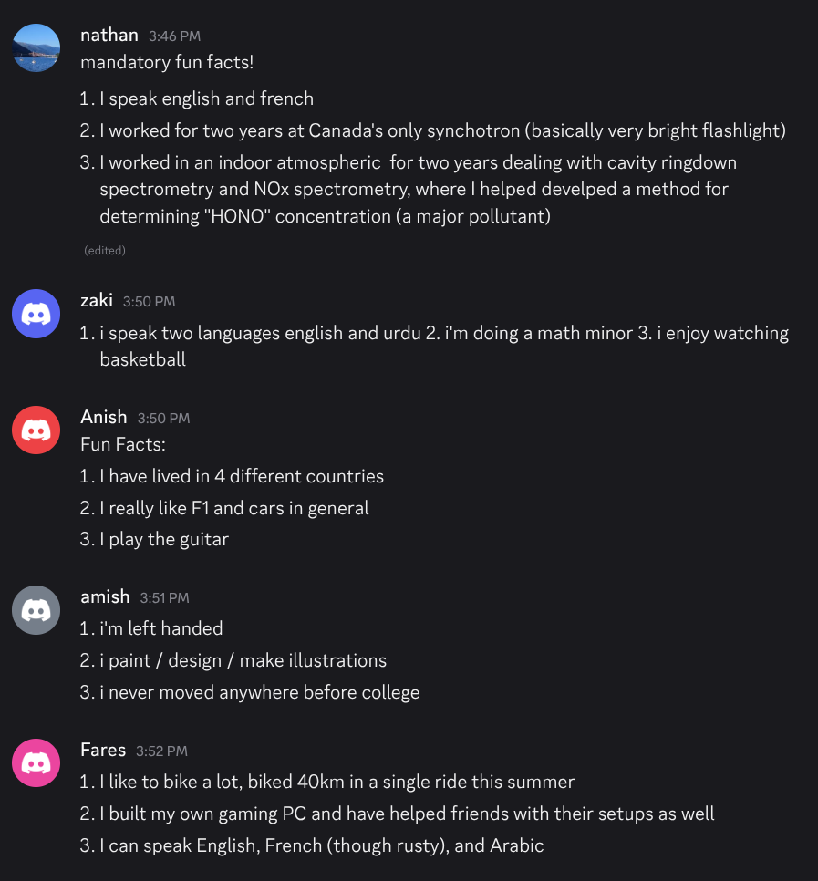

# Orali Wallet for Android / fooBaz

## Product Details

### Q1: What is the product?

There are approximately one billion people globally who are innumerate or illiterate, and they have historically been excluded from advancements in personal financial management. To bridge this gap, our partners have re-engineered the user interface and user experience of the existing Taler wallet. This decentralized and anonymous microtransaction wallet now uses pictographs and animations specifically designed to be accessible to people who are innumerate and illiterate. Our partners' current prototype is only available on iOS, but with the help of Taler's lead Android developer, we will be implementing the wallet for Android devices.

Our partners are:

1.  **My Oral Village**
    -   Brett (Founder, Community Testing)
    -   David (Director of Partnerships)
2.  **Taler Systems**
    -   Marc (iOS developer; project lead)
    -   Iván (Android developer)

  Figma Mockup Demo:

  [Interactive Figma Mockup](https://www.figma.com/proto/FPXpoiX6Ql8czYFsWI9rjC/Orali-Money-App--Copy-?node-id=2-80&p=f&t=49X8TySxlxNCHNNc-1&scaling=scale-down&content-scaling=fixed&page-id=0%3A1&starting-point-node-id=2%3A80)

 [Static Figma Mockup](https://www.figma.com/design/88A4qRhHzTOkz0WNFHre3p/Untitled?node-id=0-1&t=1w6LR8YT0qIxutu3-1)

### Q2: Who are your target users?
Our primary users are illiterate and/or innumerate adults who lack formal schooling. The goal is to provide an easily and safely usable mobile wallet that makes sending money, validating transfers, and viewing transaction history intuitive and accessible. The wallet will aim to build their "financial numeracy", the ability to independently understand financial records in order to empower them with the ability to manage their money.

### Q3: Why would your users choose your product? What are they using today to solve their problem/need?
For the world's one billion illiterate and innumerate adults, managing money has many challenges. They rely on informal methods like memorization, or trusting literate family members or agents, which exposes them to fraud, theft, and a lack of financial privacy and control. Existing mobile banking apps are not an option as they are text-based and require numerical literacy, effectively excluding this vast population. 
Orali Money addresses this gap by offering a visually intuitive and easily learnable mobile wallet designed specifically for those with little to no formal schooling. 
 The reasons why people would want our product is firstly,
It provides a form of intuitive financial independence. With an intuitive, graphic-based interface, users can send, receive, and verify money on their own, and keep it private as well, which many people would want to do. But they are unable to currently, due to their lack of understanding.
Secondly, users can now understand their finances and track history reliably, which before, they would basically have to rely on memory, as they can't read or write.
 This project aligns with our partners core missions as well as My Oral Village is creating financial tools and projects that illiterate adults can use safely and independently. Taler focuses on building secure, private, and open-source payment systems. We are building a very similar app to one already made in iOS by Taler/MOV, so it aligns with our partner's mission very well.

### Q4: What are the user stories that make up the Minumum Viable Product (MVP)?
#### User Stories

| **Title** | **Description** | **Acceptance Criteria** |
| --- | --- | --- |
| **Sending Money** | I am a person who may be illiterate / innumerate and I need to send money to people who may have low literacy or be unfamiliar with technology. I need a user-friendly application that allows me to quickly and securely transfer funds. | Upon opening the app, the user must press the centered treasure chest symbol to access their banking activities. After that, the user selects the "giving hand" symbol in the upper right-hand corner to start a transaction of giving money. At this stage, the user is presented with all denominations of local currency (currently only leones) where they can select them to increment the payment amount that they are sending. When they are done, they press the right hand in the upper right corner. This presents a screen of buttons denoting the destination of where their money will be sent (e.g. electricity). After pressing one of these buttons, a screen with a QR code is shown where this QR code is then scanned to have the money sent. Finally, the user is presented with a screen with arrows demonstrating the flow of money (from the money originally in their bank account) to the money after the transaction. |
| **Receiving Money** | As an **adult user with low literacy and numeracy skills**, I want **clear and simple notifications when I receive money**, so that I can **immediately know and confirm the transaction without confusion**. | The user receives an in-app notification that they have received money (with an audio icon next to it, which can be pressed to hear the amount - being used primarily by those who are illiterate and/or innumerate). Afterward, they are then taken to a different page in the app which demonstrates the flow of money and how their bank balance has increased. |
| **Visual Transaction History** | As an **adult user with limited literacy skills**, I want to **check past money transactions using visual representations**, so that I can **keep track of my financial activity without needing to read written records**. | \- Transactions ordered chronologically and flow is easy to understand  \- Date of transaction is visually represented based on the current day (ie: if a transaction was done "2 days ago", visually represent it as "2 days from today, user had X transaction")  \- Can be easily explained by individuals who know the software and remembered by those with low literacy  \- Has "advanced options" for more detailed transactional records, but avoids it on the main UI/UX |
| **Onboarding/Demo Feature** | As a literate adult user who might not be extremely tech savvy, I would like there to be a demo transaction and walkthrough that familarizes me with the components of the app and how it should be used. I want this so I can easily show my illiterate / inumerate loved ones. | Upon opening the app the first time, there should be a walkthrough that shows me how to interact with the basic features of the app. It should cover how to send/receive money and see transaction history, and use an OIM interface for the current demo mode in the Taller wallet. |

#### Partner Approval

### Q5: Have you decided on how you will build it? Share what you know now or tell us the options you are considering.

We have decided to build **Orali Money for Android** using **Kotlin** with **Jetpack Compose** as our main UI toolkit. After considering alternatives (e.g., Scala, which was too enterprise-oriented with limited APIs), Kotlin with Compose provides the best support for modern Android development.

**Technology stack (current plan):**
- **Frontend:** Kotlin + Jetpack Compose (modern declarative UI framework for Android).
- **Backend:** **Out of scope for our team**. Backend services and the payment engine are handled by **Taler Systems**. We will focus only on the UI and frontend logic:contentReference[oaicite:0]{index=0}.
- **Architecture:** MVVM (Model–View–ViewModel) pattern for clean separation of concerns.
- **Build System:** **Gradle** (Android Gradle Plugin) will manage project dependencies, build variants, and CI/CD integration. Gradle allows modular builds, dependency resolution, and seamless APK generation for different environments.
- **APIs / Integrations:**
  - Device-native authentication (PIN, fingerprint, Face ID) rather than custom authentication:contentReference[oaicite:1]{index=1}.
  - Integration with **GNU Taler** ([taler.net](https://www.taler.net/en/index.html)), a privacy-preserving payment system, for transaction processing and balance verification.
  - Graphics and icons from MyOralVillage’s OIM project, adapted for Android.
- **Deployment:** The app will be packaged as an APK and tested on both emulators and physical devices. Partner collaboration may also extend to publishing on the Google Play Store once features are production-ready.
- **Version Control / Collaboration:** GitHub will serve as the central repository, shared with Ivan (partner Android developer) for asset and code synchronization:contentReference[oaicite:2]{index=2}.

## Intellectual Property Confidentiality Agreement 

1. Our code will be released on a FLOSS license 
2. We may upload our code to a public repository 
3. Our team will only reference the work we did in our resume, interviews, etc.

Our partners communicated that our repository will be released 
under the GNU General Public License >= version 3. As such, we may 
freely run, share, distribute, and modify the software as we wish. 

## Teamwork Details

### Q6: Have you met with your team?

On our 2nd meeting together, we did some ice breakers and shared some fun 
facts about ourselves:

The following meeting, we took some time to play a few discord games together:

We have also been getting to know each other by chatting before meetings and on discord.

### Q7: What are the roles & responsibilities on the team?
Amish Mamtani is the lead front end developer and product manager. 
He will be responsible for overall product management and front 
end development. Zaki Ali and Fares Alkorani will be working with Amish 
on product design and front end work, and will be working on testing as well. 
Anish Pai will focus on CI\CD and testing and will support the front end team
to ensure that their work is continuously scalable and passing our tests.
Nathan Shea Ouedraogo served as the Project Lead and Project Manager. He 
will be maintaing the repository integrety and serve as the main point of 
contact between the partners and the team. He will also contribute to CI\CD
and front end development as needed.

### Q8: How will you work as a team?

 As a team, we have two 2-hour meetings per week, on Sundays and Thursdays, 
and one brief meeting on Wednesday. 
We meet on either Discord or Google Meets. For each meeting, we assign a 
scribe to take notes and a lead to run the meeting. We plan the agenda for 
the next meeting at the end of each one, ensuring every meeting has 
specific issues and tasks to address. These are all tracked in our 
meeting minutes. We also have a weekly 2-hour meeting with our partners 
every Tuesday. 
    
 Since our team and our partners are spread across four time zones 
and three continents, we were only able to schedule one meeting 
before our first deliverable. Our initial meeting on September 23, 
2025, covered introductions and an agreement on the project’s 
Minimum Viable Product (MVP), which we defined through user 
stories. We also discussed our tech stack, how we will integrate 
with the existing project, and identified potential risks and 
mitigation strategies.

### Q9: How will you organize your team?

#### Meeting schedule breakdown
As outlined in the previous section, we will have 4 meetings per 
week, including one meeting with our partners.
Below is a breakdown of the meetings:

* **Wednesday**
    + Each team member gives small progress report / standup
    + finalize what to present for TA and what proof we need
    + finalize high level plan for next week's sprint
* **Thursday**
    + Discuss meeting w/ TA
    + Debrief last week's sprint / look for improvements and pain points
    + Assign Issues and milestones on github
* **Sunday**
    + each member gives a progress report / stand up
        - identify pain points
        - identify progress
        - identify hurdles / roadblocks
        - give proof / concrete examples of what we did
    + consolidate progress reports into one high-level report for partner
    + agree on high-level plan for next week's sprint
    + agree on actionable items for sprint
        - gather responsibles 
        - gather what we need from partners 
* **Tuesday**
    + meeting with partners
    + present high level progress report / standup
    + present idea for sprint for next week
    + address partner concerns and integrate them into sprint

#### Issues and Github Projects
Our team will be using Github projects as the main team management platform. 
Each release / feature is organized into specific projects, and each project is 
composed of multiple concrete milestones. These milestones have issues assigned 
to them which we have agreed upon in our meeting, and dates which they are due by. Finally, 
we have meeting minutes to fall back on if we need to reference anything. 
If we have a major task, our project manager brings it up in the 
weekly sprint planning meeting (or a team member suggests it). 
We then discuss what sub tasks we need to delegate and which team 
members will be best suited for that role. 
We then assign issues and add it to the appropriate milestone. 
Issues are prioritized by issue dependency, and how critical an issue is to the overall
project being implemented. Issues are organized in our Github project 
by either being in the "TODO" (not started/non-priority), "WIP" (work 
in progress; currently completing), "review/testing" (waiting 
approval or tests), or "done" (issue has been completed 
successfully). When all issues are in the "done" category, that means 
our feature has been thoroughly tested and released, and we are ready 
to move on to the next project. We have a workflow in github which 
automatically reminds assignees of open issues each day and when
they are due. Another workflow sends biweekly reminders for 
milestones (which change to daily when the milestone is <= 2 days 
away or overdue).

#### Communication
We will be using Mumble and Discord for unofficial / casual conversations, 
email for official conversations, and BBB for video calls and presentations.

### Q10: What are the rules regarding how your team works?
Our partners communicate mainly through outlook, and our project
leader serves as the main point of contact.
Our team is expected to communicate and read our internal discord
at least once a day. We are held responsible through issue tracking, 
weekly standups, and progress reports with the TA. If a team member is
not responsive, we will first try our best to get in contact with 
that team member. In the mean time, their work is delegated to 
other team members by the project manager. If they continue to be 
unresponsive and do not contribute, we will then escalate to the TA 
to take appropriate next steps.

## Organisation Details
### Q11. How does your team fit within the overall team organisation of the partner?

 We are a part of the android development team. We are rebuilding the existing iOS app into a native Android version that maintains the core interface while also integrating the Oral Information Management (OIM) interface. We’ll be working closely with Iván Ávalos, the Android developer at Taler Systems who is also contributing to the Orali Money app. At the same time, we’ll be reporting key milestones and design decisions to Brett Matthews (Founder, MyOralVillage), David Myhre (Director of Partnerships, MyOralVillage), and Marc Stibane (iOS Developer, Taler Systems).

 We believe this role is a strong fit for us because it is very front-end and user-experience focused, and our team has solid experience in both areas. For example, Amish worked on the Centre for Dreams app with UofT Blueprint, designing accessible user journeys for people with developmental disabilities. Fares brings front-end and UI/UX internship experience, along with industry knowledge of working with external stakeholders. Other team members also have internship and project experience in development and design, including areas such as backend and full stack development, giving us a strong and well-rounded foundation. Together, we are well-positioned to create solutions that prioritize accessibility, clarity, and usability for the app’s target users.
### Q12. How does your project fit within the overall product from the partner?    

 Our project fits into the partner’s overall product as the Android version of the Orali Money app, designed to make money management accessible to users with different literacy and numeracy levels, including those who are illiterate or innumerate. While this is not the first prototype since an iOS version already exists, our work focuses on building an MVP for Android that expands the app’s reach and makes it more accessible to its target users.

 The MVP will include core features such as sending money, making payments in stores, and maintaining a clear record of balances and past transactions. A major emphasis of our work is on the Oral Information Management (OIM) interface, which aims to improve usability and make the app intuitive for users who may struggle with traditional text or number-heavy interfaces.

 On the technical side, we will collaborate closely with Iván Ávalos (Android developer, Taler Systems) for guidance, while consulting Brett Matthews (Founder, MyOraliVillage), David Myhre (Director of Partnerships), and Marc Stibane (iOS Developer, Taler Systems) for key decisions and milestones. This ensures consistency across both iOS and Android development.

 For our partner, success means delivering a usable MVP on Android, with particular attention to the OIM component. This MVP will then be tested with the company and its target users, serving as the foundation for future iterations and improvements of the product.

## Potential Risks

### Q13: What are some potential risks to your project?

- **Designing for low-literacy, low-numeracy users**  
  Creating an interface that is truly intuitive and understandable for illiterate/innumerate adults is a challenge. Even small design missteps (icons, flows, or colors) could confuse users.

- **Scope creep and misaligned expectations**  
  Partners have flagged certain features as out-of-scope (e.g., onboarding, warnings, bank withdrawals). There is a risk of the team unintentionally expanding scope beyond what’s feasible.

- **Collaboration across iOS/Android teams**  
  Coordination with Ivan (Android dev) and Marc (iOS dev) may face challenges in asset/code sharing, version control, and ensuring design consistency.

- **Limited experience with this unique user group**  
  Most of the team does not have direct experience designing for illiterate users, which may result in gaps between assumptions and actual user needs.

- **Technical complexity of visual language**  
  Icons, animations, and graphic capacities (e.g., place value, tabular formats) are critical for OIM but may be difficult to implement smoothly on mobile devices.

### Q14: What are some potential mitigation strategies for the risks you identified?

- **For user interface challenges:**  
  Prioritize **user testing** early with sample icons and flows. Focus on **iterative design** with feedback from partners in Sierra Leone who already work with target users.

- **For scope creep:**  
  Clearly document and re-confirm with partners which features are **in-scope vs. out-of-scope**. Track any new feature ideas for later phases rather than committing immediately.

- **For collaboration issues:**  
  Use a **shared GitHub repo** and maintain consistent documentation. Weekly sync meetings with Ivan and Marc will help align Android and iOS versions.

- **For gaps in understanding user needs:**  
  Leverage **partner expertise** (Brett and David from MyOralVillage) to validate design assumptions. Conduct walkthroughs of the OIM demo to guide UI design.

- **For technical complexity of graphics:**  
  Start with a **simplified icon/animation set** from the Salone OIM Library and gradually expand. Use Jetpack Compose’s graphics/animation APIs, which are well-suited for custom UI elements.